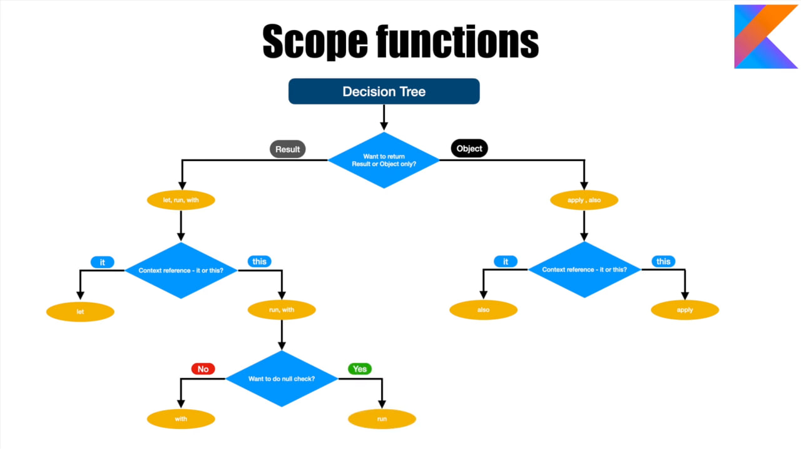

# 24.01.2026 (Week 1 / Day 5) ~6.h

Сегодня работа с Extensions + scope functions: apply/also/run/with/let.

Нашёл вот такую схему, чтоб легче было запомнить.

- [x] Проработал Extensions (расширение функций)
- [x] apply понял
- [x] also понял
- [x] run понял
- [x] with понял
- [x] let понял
---
> Тема довольно объёмная и трудная.
>
> Главное не запутаться )